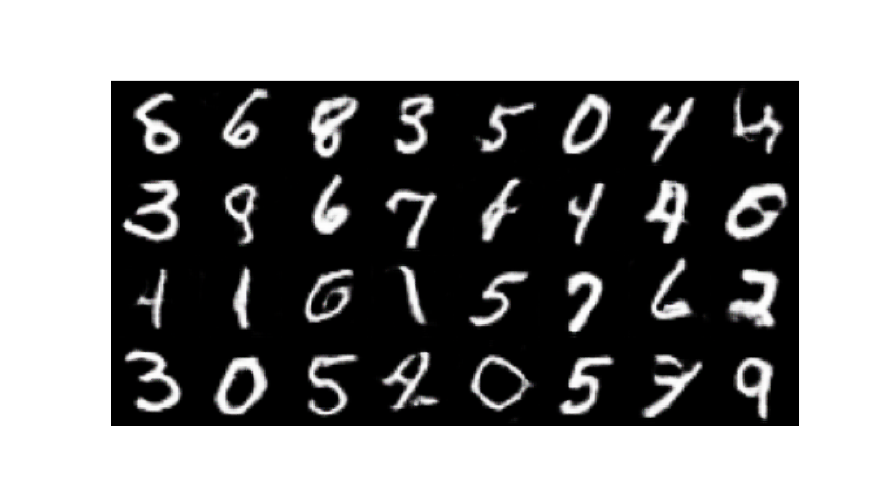

# WGAN-GP

### Title
[Improved Training of Wasserstein GANs](https://arxiv.org/abs/1704.00028)

### Abstract
Generative Adversarial Networks (GANs) are powerful generative models, but suffer from training instability. The recently proposed Wasserstein GAN (WGAN) makes progress toward stable training of GANs, but sometimes can still generate only low-quality samples or fail to converge. We find that these problems are often due to the use of weight clipping in WGAN to enforce a Lipschitz constraint on the critic, which can lead to undesired behavior. We propose an alternative to clipping weights: penalize the norm of gradient of the critic with respect to its input. Our proposed method performs better than standard WGAN and enables stable training of a wide variety of GAN architectures with almost no hyperparameter tuning, including 101-layer ResNets and language models over discrete data. We also achieve high quality generations on CIFAR-10 and LSUN bedrooms.

## Train
    $ python main.py --mode train \
                     --scope [scope name] \
                     --name_data [data name] \
                     --dir_data [data directory] \
                     --dir_log [log directory] \
                     --dir_checkpoint [checkpoint directory]
---
    $ python main.py --mode train \
                     --scope wgan-gp \
                     --name_data celeba \
                     --dir_data ./datasets \
                     --dir_log ./log \
                     --dir_checkpoint ./checkpoint

* Set **[scope name]** uniquely.
* To understand hierarchy of directories based on their arguments, see **directories structure** below. 
* Hyperparameters were written to arg.txt under the log directory.

## Test
    $ python main.py --mode test \
                     --scope [scope name] \
                     --name_data [data name] \
                     --dir_data [data directory] \
                     --dir_log [log directory] \
                     --dir_checkpoint [checkpoint directory] \
                     --dir_result [result directory]
---
    $ python main.py --mode test \
                     --scope wgan-gp \
                     --name_data celeba \
                     --dir_data ./datasets \
                     --dir_log ./log \
                     --dir_checkpoint ./checkpoints \
                     --dir_result ./results

* To test using trained network, set **[scope name]** defined in the **train** phase.
* Generated images are saved in the **images** subfolder along with **[result directory]** folder.
* **index.html** is also generated to display the generated images.  

## Tensorboard
    $ tensorboard --logdir [log directory]/[scope name]/[data name] \
                  --port [(optional) 4 digit port number]
---
    $ tensorboard --logdir ./log/wgan-gp/celeba
                  --port 6006
                  
After the above comment executes, go **http://localhost:6006**

* You can change **[(optional) 4 digit port number]**.
* Default 4 digit port number is **6006**.

## Result

* The results were generated by a network trained with **celeba** dataset during **10 epochs**.
* After the Test phase runs, execute **display_result.py** to display the figure.

## Directories structure
    pytorch-WGAN-GP
    +---[dir_checkpoint]
    |   \---[scope]
    |       \---[name_data]
    |           +---model_epoch00000.pth
    |           |   ...
    |           \---model_epoch12345.pth
    +---[dir_data]
    |   \---[name_data]
    |       +---000000.jpg
    |       |   ...
    |       \---12345.png
    +---[dir_log]
    |   \---[scope]
    |       \---[name_data]
    |           +---arg.txt
    |           \---events.out.tfevents
    \---[dir_result]
        \---[scope]
            \---[name_data]
                +---images
                |   +---00000-output.png
                |   |   ...
                |   +---12345-output.png
                \---index.html

---

    pytorch-WGAN-GP
    +---checkpoints
    |   \---dcgan
    |       \---celeba
    |           +---model_epoch00001.pth
    |           |   ...
    |           \---model_epoch0010.pth
    +---datasets
    |   \---celeba
    |       +---000001.jpg
    |       |   ...
    |       \---202599.png
    +---log
    |   \---wgan
    |       \---celeba
    |           +---arg.txt
    |           \---events.out.tfevents
    \---results
        \---wgan
            \---celeba
                +---images
                |   +---0000-output.png
                |   |   ...
                |   +---0127-output.png
                \---index.html
 
* Above directory is created by setting arguments when **main.py** is executed.               
        